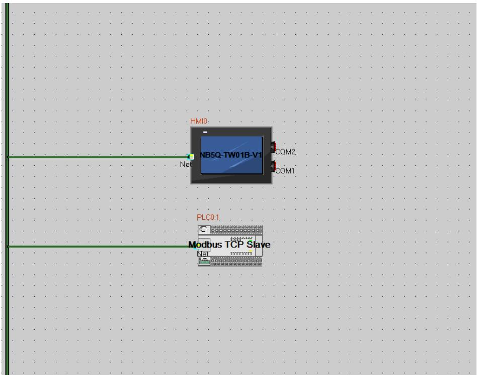
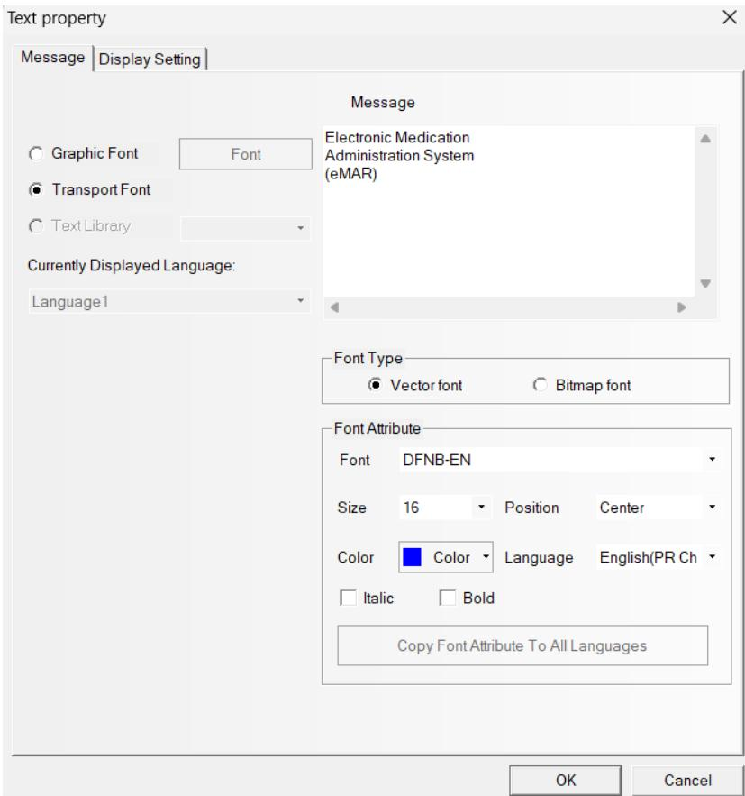
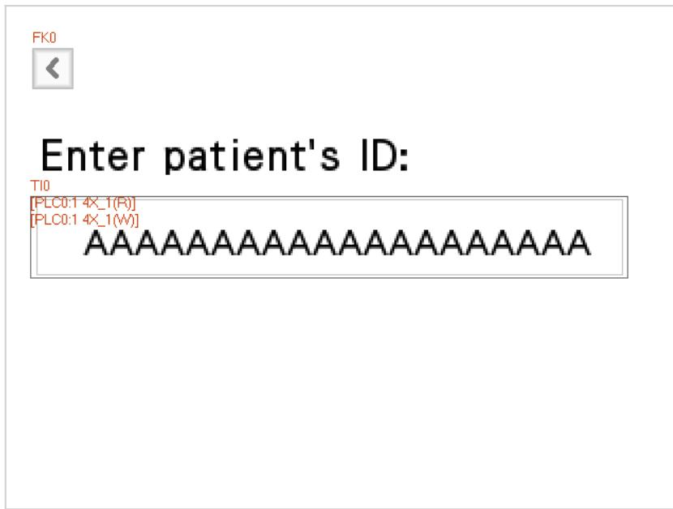
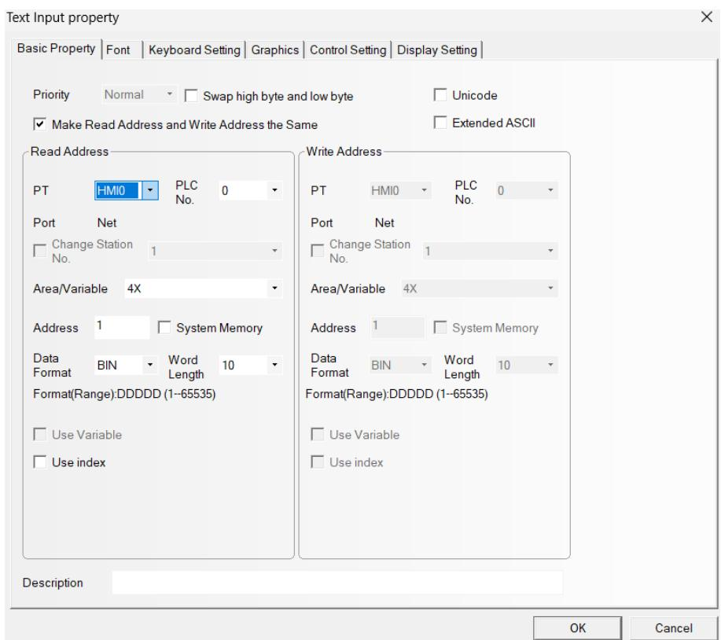
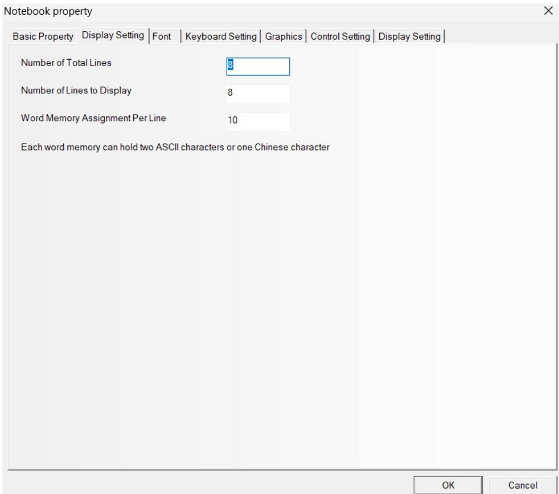
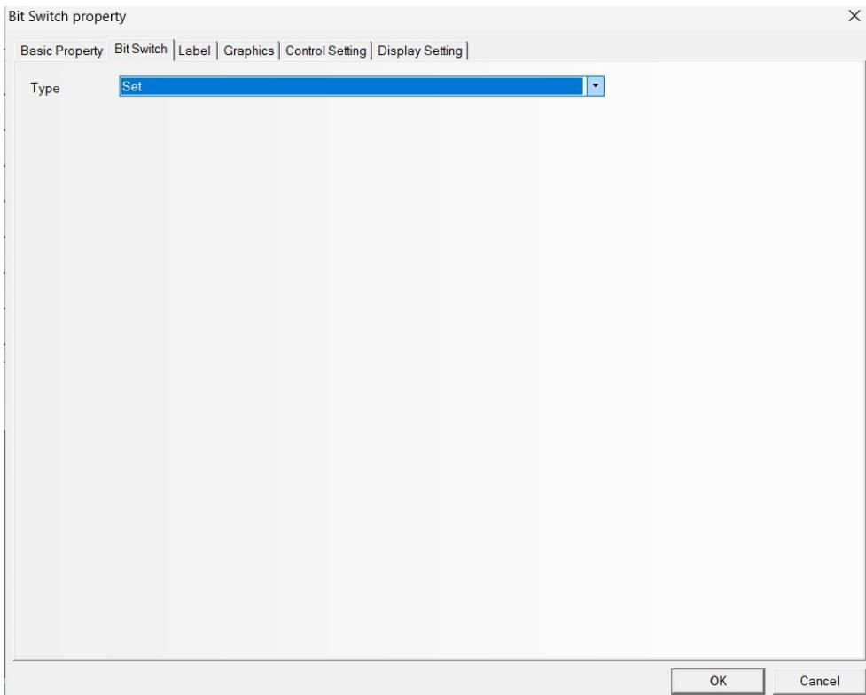

# Appendix A: HMI Configuration Guide (NB Designer)

This appendix provides a step-by-step configuration guide for the Omron NB-series HMI using NB Designer software.

## Communication Setting

| Device | IP Address | Port No. | Protocol | Master/Slave | Station No. |
| :--- | :--- | :--- | :--- | :--- | :--- |
| HMI0 | 192.168.250.4 | 10502 | Modbus TCP | Master | |
| PLC0 | 192.168.250.2 | 10502 | Modbus TCP | Slave | 1 |

## Screen 0: Main Menu

The main menu allows navigation to the Patient ID entry screen and the Medication display screen.

**Function Keys:**
- **FK0 (Set Patient ID):** Navigates to Screen 10.
- **FK1 (See Medication):** Navigates to Screen 11.

*Figure A.1: Main Menu Screen Design*

## Screen 10: Set Patient ID

This screen allows the user to input the Patient ID.

**Components:**
- **Text Input:** Mapped to Holding Registers 0-9 (Word Length: 10).
- **Function Key (<):** Returns to the Main Menu.

*Figure A.2: Patient ID Entry Screen*

### Component Configuration Details

**Text Input Settings:**
- Word Length: 10 (20 characters)
- Address Type: Holding Registers

## Screen 11: Medication Display

This screen displays the list of medications for the identified patient and scheduled time.

**Components:**
- **Notebook:** Displays text lines (8 lines x 20 chars). Mapped to Holding Registers starting at address 30.
- **Bit Switch (Served):** Mapped to Coil 1. Used to confirm administration.
- **Function Key (<):** Returns to the Main Menu.

*Figure A.3: Medication List Screen*

### Component Configuration Details

**Notebook Settings:**
- Start Address: 30
- Words per line: 10
- Number of lines: 8

**Bit Switch Settings:**
- Address: Coil 1
- Function: Toggle or Momentary (handled by logic)

## Register Address Logic

The Modbus register map was designed to optimize data organization and allow for future expansion:

- **Holding Registers 0-9 (Patient ID):** Allocated the first 10 words (20 bytes) for the Patient ID. This is placed at the beginning of the memory map (Address 0) for easy access and debugging.
- **Reserved Space (Registers 10-29):** A gap of 20 registers is intentionally left reserved to accommodate future metadata fields (e.g., Nurse ID, Ward ID, or Status Flags) without requiring re-addressing of the medication display block.
- **Holding Registers 30-109 (Medication Display):** A contiguous block of 80 registers is allocated for the 8 lines of text. Keeping this block contiguous allows for efficient "Block Write" (FC16) operations, reducing network overhead compared to writing lines individually.
- **Coil 1 (Served Button):** A separate memory area (Coils) is used for boolean control signals to distinguish control actions from data display.

## Consolidated Memory Map

For ease of reference during development and troubleshooting, the following table summarizes all HMI address assignments.

| Address Range | Data Type | Length | Function | Access |
| :--- | :--- | :--- | :--- | :--- |
| **HR 0 - 9** | Holding Register | 10 Words | Patient ID Input String | Read/Write |
| **HR 10 - 29** | Holding Register | 20 Words | *Reserved for Future Use* | - |
| **HR 30 - 109** | Holding Register | 80 Words | Medication List Display (8 lines x 10 words) | Read Only |
| **Coil 1** | Boolean Coil | 1 Bit | "Served" Confirmation Button | Write Only |

## Error Handling Configuration

The HMI and Node-RED interface implements the following error handling strategies (see also [Node-RED Implementation](../nodered/REPORT.md)):

1.  **Communication Timeout:** If the HMI loses connection with the Node-RED edge device (e.g., network cable disconnected), the HMI is configured to display a "PLC No Response" system error message after a 3-second timeout. This alerts the user to physical connectivity issues.
2.  **Invalid Data Display:** If the Node-RED flow encounters an error or returns empty data, it is programmed to write space characters (ASCII 32) to the display registers. This ensures the screen clears rather than showing stale or garbage data from a previous patient.
3.  **Input Validation:** The HMI Text Input component is restricted to ASCII characters, preventing the entry of invalid control characters that could disrupt the string decoding logic in Node-RED.
de-RED.
