# eMAR System Architecture

This document provides comprehensive architecture diagrams and explanations for the Electronic Medication Administration Record (eMAR) system.

## Table of Contents
- [System Overview](#system-overview)
- [Component Architecture](#component-architecture)
- [Data Flow Diagrams](#data-flow-diagrams)
- [ThingSpeak Integration](#thingspeak-integration)
- [Queue Management System](#queue-management-system)

---

## System Overview

The eMAR system is a web-based application that manages patient information, medication prescriptions, and administration tracking using ThingSpeak IoT platform for cloud data storage.

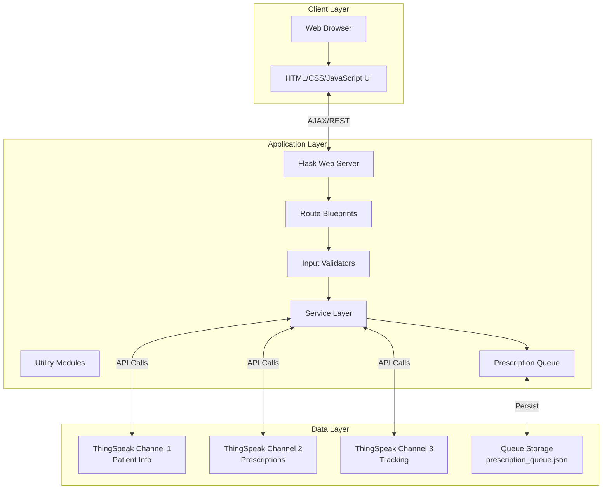

---

## Component Architecture

### Backend Components

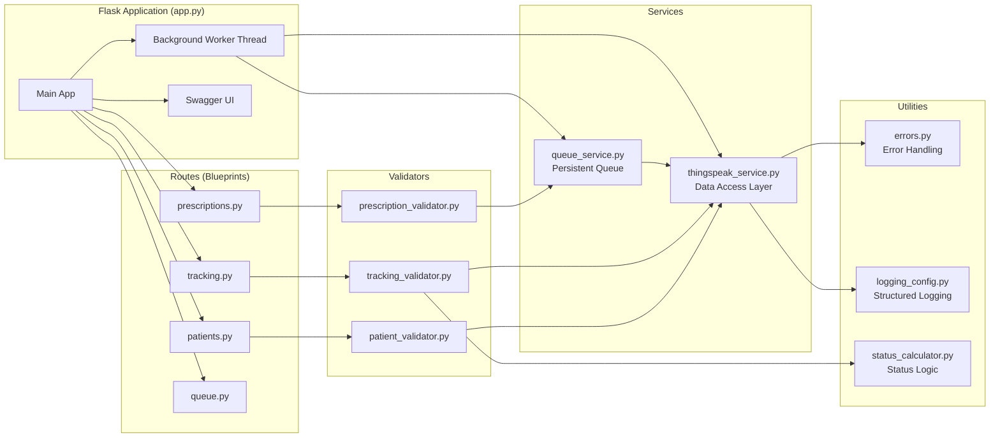

### Frontend Components

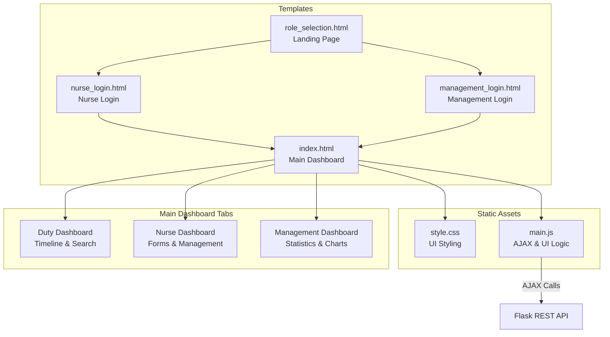

#### Frontend Logic & Patterns

While the system is backend-focused, the frontend implements several key patterns to support the architecture:

1.  **Dual-Mode Interaction**:
    - **Blocking Operations**: For Patient and Tracking updates, the frontend awaits the HTTP response (which may take 15s due to backend rate limiting).
    - **Non-Blocking Operations**: For Prescriptions, the frontend accepts an HTTP 202 immediately and refreshes the list asynchronously after a short delay, relying on the backend queue.

2.  **Client-Side Status Calculation**:
    - The Duty Dashboard (`renderTimelineTable` in `main.js`) replicates the backend's status calculation logic (`isServed`).
    - This allows for real-time visual updates of the timeline without constant round-trips for status computation.
    - **Logic Mirroring**: The frontend validates time windows (e.g., ensuring a medication consumed at 09:15 falls within the 09:00 slot) exactly as the backend `status_calculator.py` does.

3.  **Role-Based Visibility**:
    - Uses `localStorage` ("userRole") to toggle visibility of UI elements (`.nurse-only`, `.management-only`).
    - **Note**: This is a UX feature only; strict security is enforced at the backend API level (if authentication were fully implemented).

4.  **Dashboard Refresh Strategy**:
    - **Management Dashboard**: Uses a timer (`setInterval`) to poll for statistics updates every minute.
    - **Duty Dashboard**: Refreshes on load and upon specific actions (e.g., recording a medication).

---

## Data Flow Diagrams

### Patient Management Flow

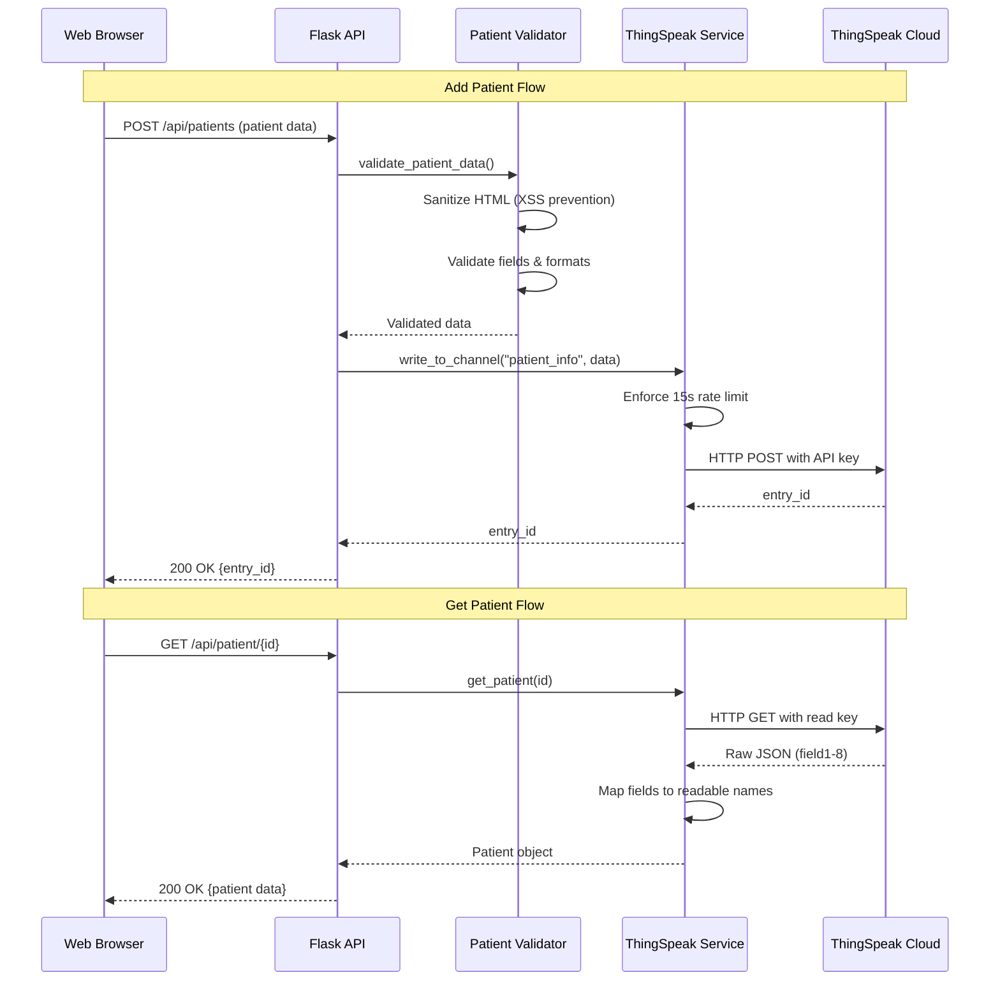

### Prescription Management Flow (Queued)

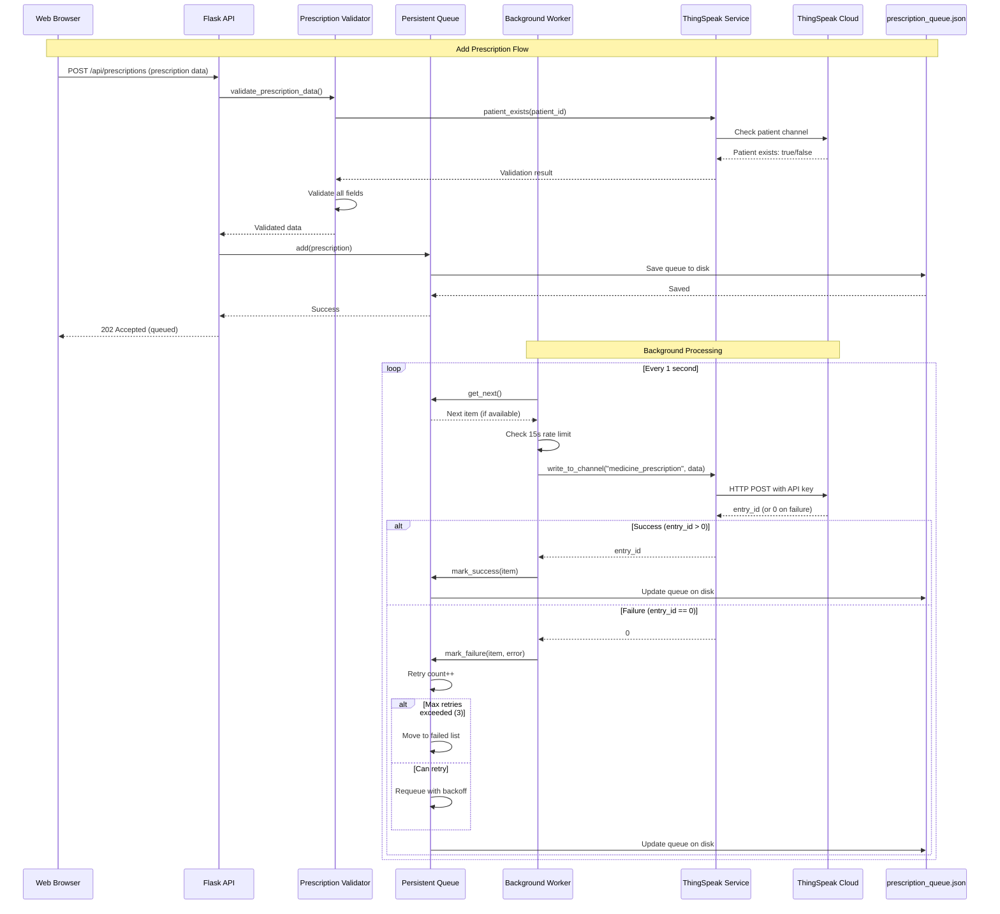

### Medication Tracking Flow

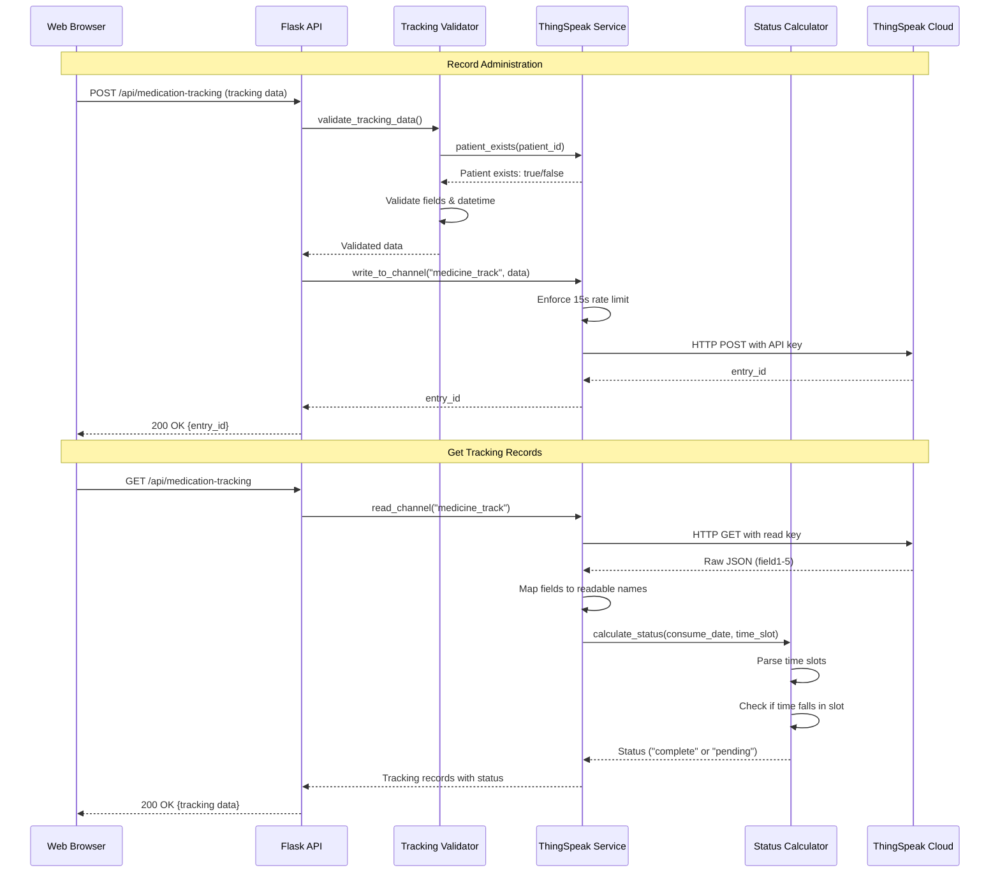

---

## ThingSpeak Integration

### Channel Configuration

```mermaid
graph TB
    subgraph "ThingSpeak Cloud"
        subgraph "Channel 1: Patient Info (3124887)"
            P1[Field1: Patient_ID]
            P2[Field2: Name]
            P3[Field3: Floor]
            P4[Field4: Room]
            P5[Field5: Bed]
            P6[Field6: Age]
            P7[Field7: Gender]
            P8[Field8: Notes]
        end
        
        subgraph "Channel 2: Prescriptions (3124898)"
            R1[Field1: Patient_ID]
            R2[Field2: Medicine_Name]
            R3[Field3: Dosage]
            R4[Field4: Frequency]
            R5[Field5: Start_Date]
            R6[Field6: End_Date]
            R7[Field7: Time_Slot]
        end
        
        subgraph "Channel 3: Tracking (3131200)"
            T1[Field1: Patient_ID]
            T2[Field2: Medicine_Name]
            T3[Field3: Dosage]
            T4[Field4: Consume_Date]
            T5[Field5: Time_Slot]
        end
    end
    
    subgraph "API Keys (from .env)"
        PW[Patient Write Key]
        PR[Patient Read Key]
        RW[Prescription Write Key]
        RR[Prescription Read Key]
        TW[Tracking Write Key]
        TR[Tracking Read Key]
    end
    
    PW -.->|Write| P1
    PR -.->|Read| P1
    RW -.->|Write| R1
    RR -.->|Read| R1
    TW -.->|Write| T1
    TR -.->|Read| T1
```

### Rate Limit Management

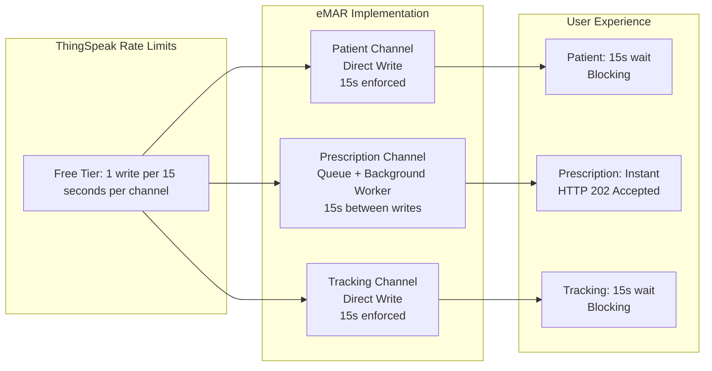

---

## Queue Management System

### Queue Architecture

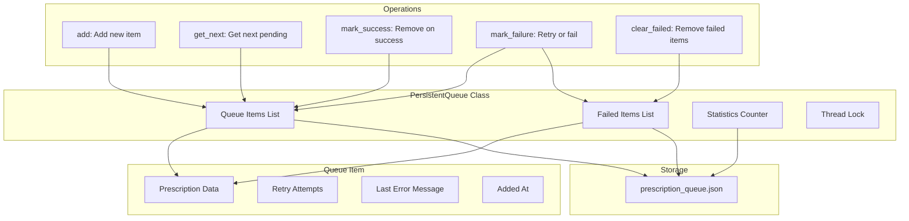

### Retry Logic Flow

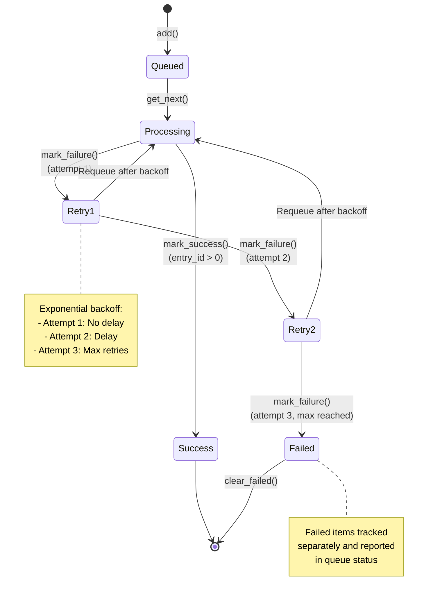

### Queue Monitoring

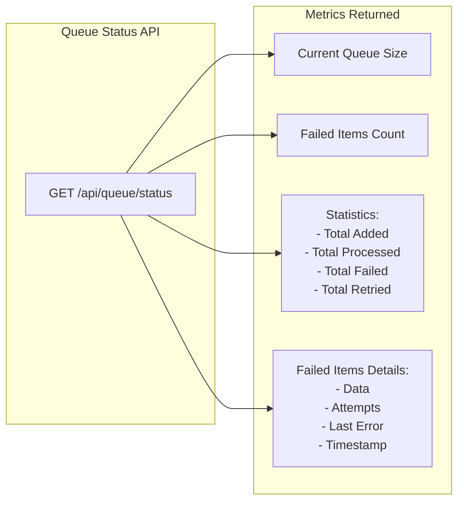

---

## Security Architecture

### Input Validation Layer

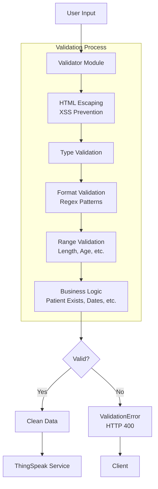

### Error Handling Flow

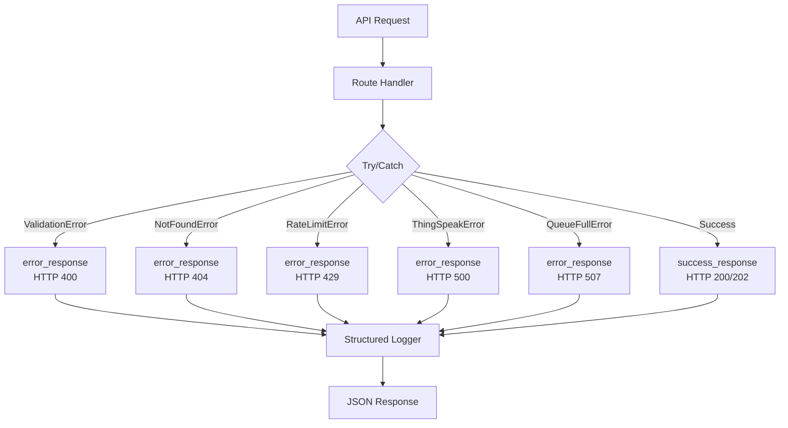

---

## Deployment Architecture

### Development Environment

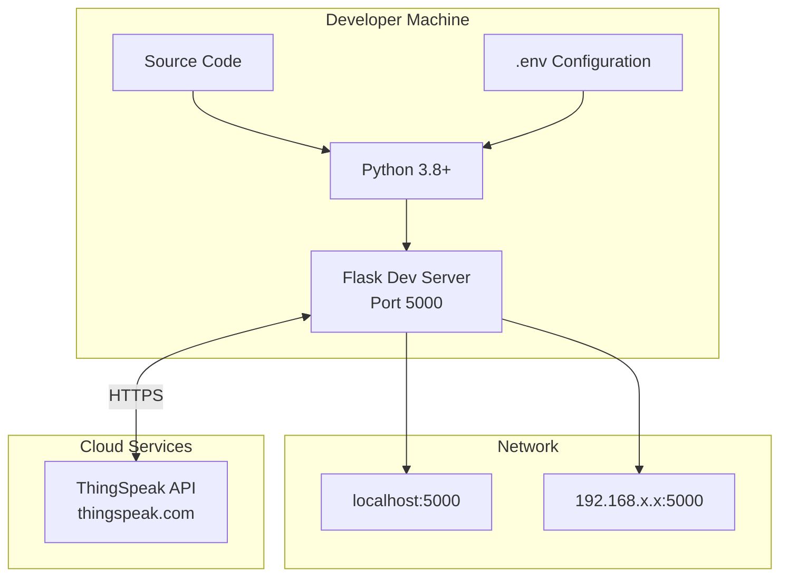

### Production Considerations

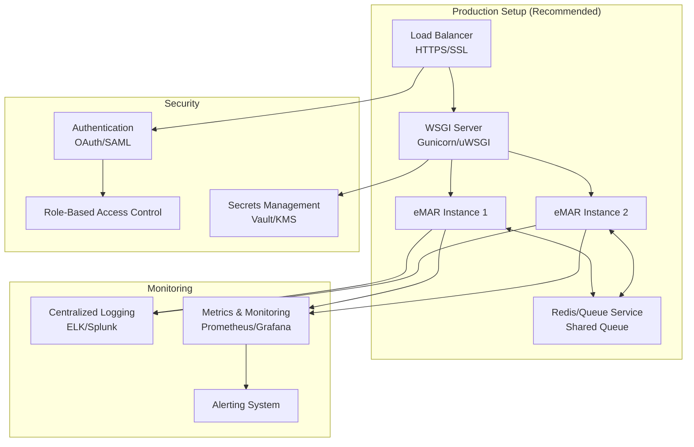

---

## Technology Stack

| Layer | Technology | Purpose |
|-------|-----------|---------|
| **Frontend** | HTML5, CSS3, Vanilla JavaScript | User interface and interactions |
| **Backend** | Flask 3.0.0 (Python) | Web framework and REST API |
| **Data Storage** | ThingSpeak IoT Platform | Cloud-based data persistence |
| **Queue** | In-memory with JSON persistence | Prescription background processing |
| **API Documentation** | OpenAPI 3.0, Swagger UI | Interactive API documentation |
| **Logging** | Python logging module | Structured application logging |
| **Validation** | Custom validators | Input sanitization and validation |
| **Testing** | Python unittest | Unit and integration testing |

---

## Key Design Decisions

### 1. **No Local Database**
- All persistent data stored on ThingSpeak cloud
- Simplifies deployment (no DB setup/maintenance)
- Data accessible from anywhere with internet
- Trade-off: Subject to ThingSpeak rate limits

### 2. **Background Queue for Prescriptions**
- Prescriptions use queue + background worker
- Avoids blocking UI for 15 seconds
- Queue persists to disk (survives restarts)
- Automatic retry mechanism (max 3 attempts)

### 3. **Direct Write for Patients/Tracking**
- Patient and tracking operations write directly
- 15-second wait enforced per channel
- Simpler implementation (no queue complexity)
- Acceptable UX for these operations

### 4. **Blueprint Architecture**
- Routes organized by domain (patients, prescriptions, tracking, queue)
- Clear separation of concerns
- Easy to extend and maintain
- Follows Flask best practices

### 5. **Status Calculation at Read Time**
- Medication status computed dynamically
- Not stored in ThingSpeak (saves a field)
- Always accurate based on current data
- Implemented in utils/status_calculator.py

---

## Performance Considerations

### Rate Limiting Strategy
- **ThingSpeak Limit**: 1 write per 15 seconds per channel
- **Patient Channel**: Direct write, enforced wait
- **Prescription Channel**: Queue system, no user wait
- **Tracking Channel**: Direct write, enforced wait

### Scalability Limits
- **Queue Size**: Max 1000 items (configurable)
- **Data Retrieval**: Last 100 records per channel
- **Concurrent Users**: Limited by Flask dev server (use WSGI in production)
- **Background Worker**: Single thread (one write at a time)

### Optimization Opportunities
- Implement date-range pagination for >100 records
- Use production WSGI server (Gunicorn) for concurrency
- Add caching layer (Redis) for frequently accessed data
- Implement database for local caching/faster queries

---

## Future Architecture Enhancements

1. **Database Integration**
   - Add PostgreSQL/MySQL for local data storage
   - Keep ThingSpeak as backup/cloud sync
   - Improve query performance and enable complex queries

2. **Microservices Architecture**
   - Separate patient, prescription, and tracking services
   - Independent scaling and deployment
   - Service mesh for inter-service communication

3. **Message Queue System**
   - Replace in-memory queue with RabbitMQ/Kafka
   - Better reliability and distributed processing
   - Enable multiple worker instances

4. **API Gateway**
   - Add API gateway (Kong, AWS API Gateway)
   - Rate limiting, authentication, analytics
   - Version management and routing

5. **Real-time Features**
   - WebSocket support for live updates
   - Server-sent events for notifications
   - Real-time dashboard updates

---

*Last Updated: November 15, 2025*
