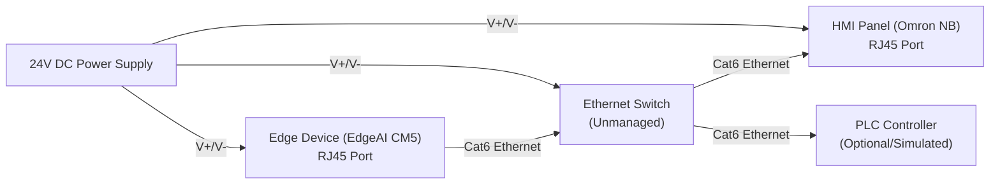
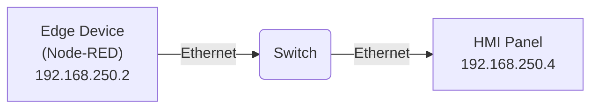
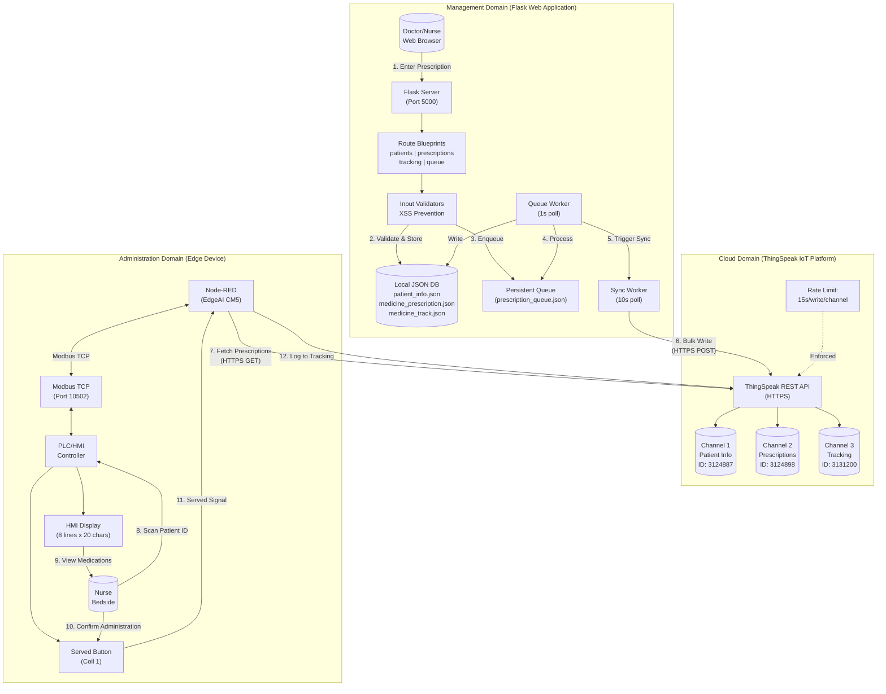
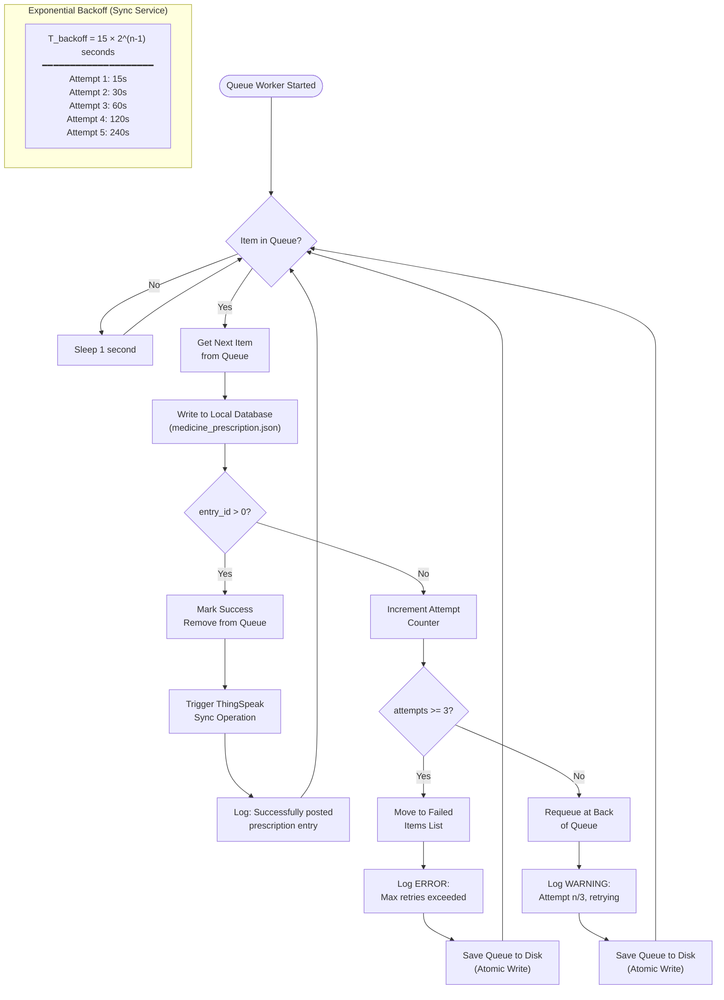
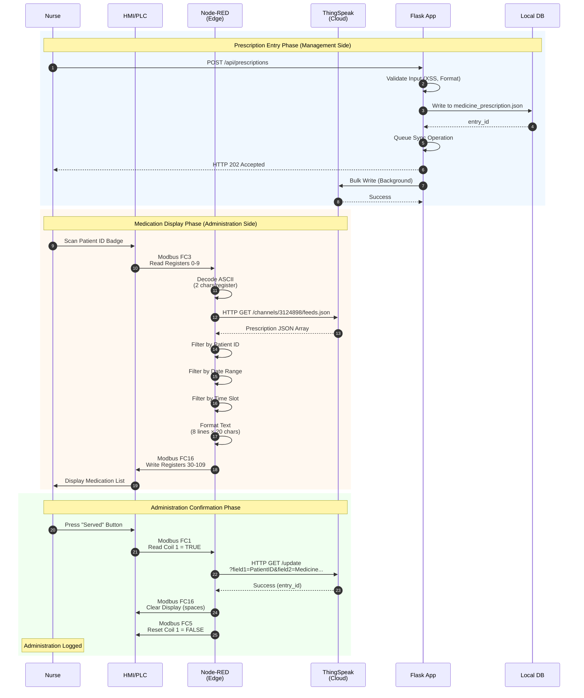
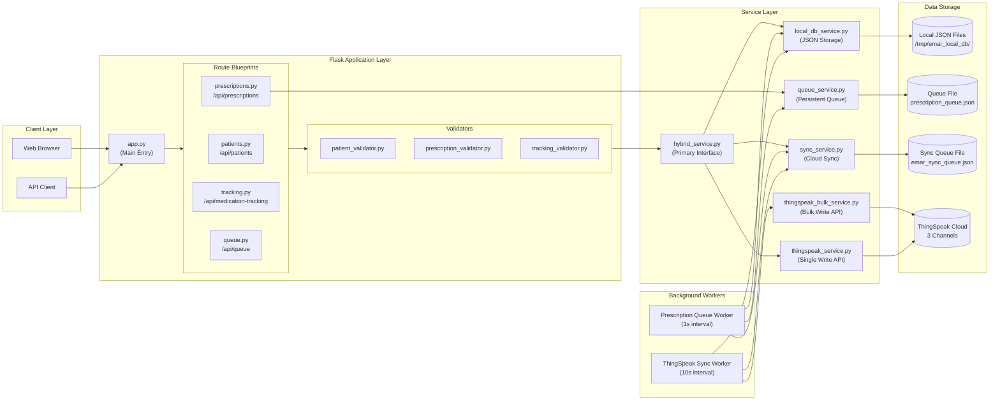
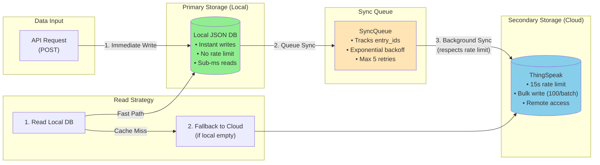
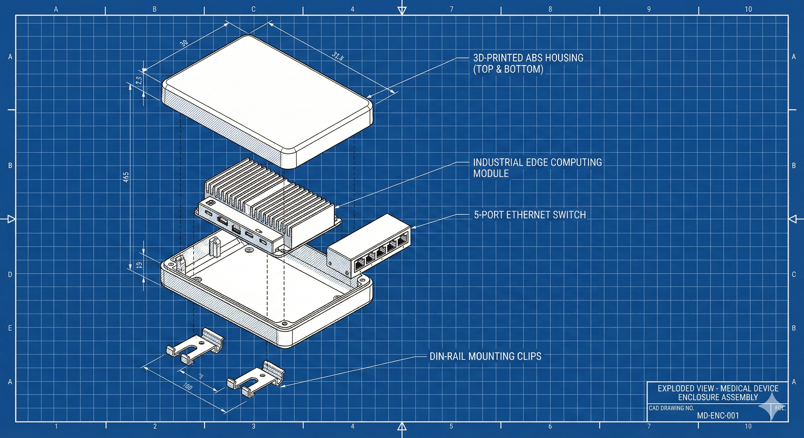

# Section 3. Proposed Method / Solution

## Section Contents
- **3.1 Unified System Architecture** (Overview, Subsystems, Interfaces)
- **3.2 Visual Representations** (System Block Diagram, Flowchart, Sequence, Component, Data Flow)
- **3.3 Design Justification & Calculations** (Latency, Throughput, Storage, Reliability, Power Budget)
- **3.4 Connection to User Needs** (Traceability Matrix)
- **3.5 Scalability & Standards** (Migration Path, Regulatory Compliance, Sustainability)
- **3.6 Summary**
- **3.7 Future Considerations** (Wireless Industrial Communication)

## 3.1 Unified System Architecture

The Electronic Medication Administration Record (eMAR) system implements a hybrid IoT/Web architecture designed to digitize medication management workflows in healthcare environments. The system addresses the complete medication lifecycle: from prescription entry by physicians, through cloud synchronization, to bedside administration by nursing staff at industrial Human-Machine Interface (HMI) terminals.

The end-to-end workflow operates as follows: A physician enters a prescription via the Flask-based Web Application, which immediately stores the data in a local JSON database for low-latency access. A background synchronization worker then replicates this data to the ThingSpeak IoT cloud platform, ensuring redundancy and enabling remote access. At the bedside, a nurse scans a patient identifier at a PLC-connected HMI terminal. The Node-RED edge application reads this identifier via Modbus TCP, queries the ThingSpeak cloud for active prescriptions, filters by the current medication round schedule, and displays the relevant medications on the HMI screen (as detailed in Figure 1). Upon administration confirmation, the system logs the event back to the cloud, completing the audit trail.

### 3.1.1 Management Subsystem (Flask/Web Application)

The Management Subsystem serves as the primary data entry and administrative interface, implemented using the Flask web framework with a Blueprint-based modular architecture. The subsystem comprises four core route modules:

- **Patients Blueprint (`/api/patients`):** Handles CRUD operations for patient demographic data including identification, location (floor/room/bed), and clinical notes.
- **Prescriptions Blueprint (`/api/prescriptions`):** Manages medication orders with full validation of medicine names, dosages, frequencies, date ranges, and time slot schedules.
- **Tracking Blueprint (`/api/medication-tracking`):** Records medication administration events with timestamps and computes real-time compliance status.
- **Queue Blueprint (`/api/queue`):** Provides monitoring endpoints for queue health, failed item inspection, and manual recovery operations.

The subsystem employs a **Persistent Queue Architecture** to handle the inherent rate limitations of the IoT cloud platform. When a prescription is submitted, the system immediately returns HTTP 202 (Accepted) to the client while enqueuing the operation for background processing. The `PersistentQueue` class implements:

- **File-based persistence:** Queue state is serialized to `prescription_queue.json` using atomic write operations (write-to-temp, then `os.replace()`), ensuring durability across application restarts.
- **Retry logic with backoff:** Failed items are requeued with incremented attempt counters, with a maximum of 3 retry attempts before permanent failure classification.
- **Thread-safe operations:** All queue mutations are protected by `threading.Lock` to ensure consistency under concurrent access.

### 3.1.2 Cloud Data Subsystem (ThingSpeak IoT Platform)

The Cloud Data Subsystem utilizes ThingSpeak as the central data bridge between the Management and Administration subsystems. ThingSpeak provides RESTful API access to three dedicated channels:

| Channel               | ID      | Purpose                | Fields                                                                        |
| --------------------- | ------- | ---------------------- | ----------------------------------------------------------------------------- |
| Patient Info          | 3124887 | Patient demographics   | patient_id, name, floor, room, bed, age, gender, notes                        |
| Medicine Prescription | 3124898 | Active prescriptions   | patient_id, medicine_name, dosage, frequency, start_date, end_date, time_slot |
| Medicine Track        | 3131200 | Administration records | patient_id, medicine_name, dosage, consume_date, time_slot                    |

The system implements a **Hybrid Storage Architecture** where the local JSON database serves as the primary data store for immediate reads and writes, while ThingSpeak functions as a synchronized backup enabling cross-site access. The `SyncQueue` service manages this synchronization with:

- **Incremental sync tracking:** Each channel maintains a `last_synced_entry_id` pointer, ensuring only new records are transmitted.
- **Exponential backoff:** Sync failures trigger retries with delays following the formula $T_{backoff} = 15 \times 2^{(n-1)}$ seconds, where $n$ is the attempt number (yielding delays of 15s, 30s, 60s, 120s, 240s).
- **Bulk write optimization:** Up to 100 records are batched per ThingSpeak API call to maximize throughput within rate constraints.

### 3.1.3 Administration Subsystem (Node-RED/PLC Interface)

The Administration Subsystem executes on an edge computing device (IRIV EdgeAI CM5) running Node-RED, providing the bridge between the cloud platform and industrial automation hardware. The system communicates with PLCs/HMIs via **Modbus TCP** protocol on port 10502.

**Modbus Register Mapping:**

| Function                 | Operation | Register Type     | Address | Quantity | Description                                           |
| ------------------------ | --------- | ----------------- | ------- | -------- | ----------------------------------------------------- |
| Read Patient ID          | FC 3      | Holding Registers | 0-9     | 10       | ASCII-encoded patient identifier (2 chars/register)   |
| Write Medication Display | FC 16     | Holding Registers | 30-109  | 80       | Notebook text (8 lines x 20 chars, 10 registers/line) |
| Read Served Button       | FC 1      | Coils             | 1       | 1        | Button press detection                                |
| Write Button Reset       | FC 5      | Coils             | 1       | 1        | Reset button state after processing                   |

The HMI screens were designed using NB Designer, the configuration software for the Omron NB-series HMI panels. The interface comprises three primary screens that guide nursing staff through the medication administration workflow:

1.  **Main Menu (Screen 0):** Presents navigation options for "Set Patient ID" and "See Medication."
2.  **Patient ID Entry (Screen 10):** A text input interface mapped to Holding Registers 0-9, allowing entry of up to 20 ASCII characters.
3.  **Medication Display (Screen 11):** A "Notebook" component showing 8 lines of text (mapped to registers 30-109) detailing the patient's scheduled medications, along with a "Served" confirmation button (Coil 1).

**For a detailed step-by-step configuration guide including component property settings and Modbus addressing setup, please refer to Appendix A: HMI Configuration Guide.**

The communication settings configure the HMI (192.168.250.4) as the Modbus TCP master connecting to the Node-RED edge device (192.168.250.2) acting as the slave on port 10502.

### Figure 1.1: Physical Connection Diagram

*Figure 1.1: Wiring diagram showing the physical connections between the Edge Device, Ethernet Switch, and HMI Panel.*

**Physical Network Topology:**

### Figure 1: HMI Interface Screens

| Main Menu | Patient ID Entry | Medication Display |
| :---: | :---: | :---: |
|  |  |  |
*Figure 1: The three primary user interface screens deployed on the Omron NB HMI.*

The Node-RED flow implements scheduled medication rounds at 09:00, 13:00, 17:00, and 21:00. The prescription filtering logic operates on three criteria. First, the patient ID decoded from PLC holding registers must match the prescription record. Second, the current date must fall within the prescription's valid date range defined by the start_date and end_date fields. Third, the current time must match one of the comma-separated time slots specified in the prescription (e.g., "09:00, 13:00, 17:00, 21:00"). The matching logic performs an exact string comparison in HH:MM format, with the cron scheduler ensuring triggers occur precisely at the designated times. For manual triggers initiated via the Node-RED dashboard, the system uses the current system time or an optional override value provided for testing purposes.

### 3.1.4 Interface Specification

The Web Application interfaces with the Cloud via REST API (HTTPS POST/GET), utilizing channel-specific API keys for authentication. The Edge Device interfaces with the Cloud via REST (GET for prescription reads, GET with parameters for tracking writes) and with the PLC via Modbus TCP. This dual-protocol architecture provides three key capabilities essential for healthcare environments.

Protocol translation enables conversion between modern web protocols and legacy industrial communication standards, allowing the integration of cloud-based data services with existing hospital automation infrastructure without requiring hardware replacement. Temporal decoupling is achieved through the cloud layer acting as a message broker, permitting asynchronous operation between the management and administration systems such that prescription entry and bedside administration need not occur simultaneously or require direct network connectivity between endpoints. Network isolation ensures that the PLC network can remain air-gapped from the internet, with only the edge device requiring cloud connectivity, thereby reducing the attack surface for industrial control systems while maintaining full functionality.

---

## 3.2 Visual Representations

### Figure 2: System Block Diagram

*Figure 2: High-Level System Block Diagram illustrating the complete data flow from prescription entry to bedside administration.*

### Figure 3: Software Flowchart - Prescription Queue Retry Logic

*Figure 3: Flowchart depicting the exponential backoff retry mechanism for the Prescription Queue Worker.*

### Figure 4: Sequence Diagram - Medication Administration Workflow

*Figure 4: UML Sequence Diagram showing the interaction between system components during a medication administration event.*

### Figure 5: System Component Architecture

*Figure 5: Detailed component architecture showing the Flask application structure and service layer.*

### Figure 6: Data Flow - Hybrid Storage Architecture

*Figure 6: Data flow diagram showing the hybrid local/cloud storage strategy with sync operations.*

### Figure 7: Mechanical Enclosure Design

*Figure 7: Conceptual exploded CAD view of the proposed industrial enclosure (AI-generated visualization).*

---

## 3.3 Design Justification & Calculations

**Assumptions for Analysis:**
1.  **Low Queue Contention:** The queue processing time ($T_{queue}$) assumes < 50 pending items, typical for a single ward.
2.  **Stable Network:** Cloud write times assume a standard 4G/LTE or hospital Wi-Fi connection with 1-2s round-trip time.
3.  **Success Rate:** A 95% per-attempt success rate is assumed for cloud HTTP requests, accounting for occasional transient failures.
4.  **Hardware:** Power calculations assume the EdgeAI CM5 is powered via 24V DC and the HMI is an Omron NB7W series.

### 3.3.1 System Latency Analysis

The total end-to-end latency from prescription entry to bedside availability is a critical performance metric. The system latency can be modeled as:

$$T_{total} [\text{sec}] = T_{queue} + T_{local\_write} + T_{sync\_delay} + T_{cloud\_write} + T_{poll}$$

**Equation 1: End-to-End Latency Model**

Where:
- $T_{queue}$: Time for item to reach front of queue ≈ 0.1s (assuming low contention)
- $T_{local\_write}$: Local JSON database write ≈ 0.01s (file I/O)
- $T_{sync\_delay}$: Maximum wait for sync worker poll ≈ 10s (worker sleep interval)
- $T_{cloud\_write}$: ThingSpeak API round-trip ≈ 1-2s (network dependent)
- $T_{poll}$: Node-RED prescription refresh interval ≈ 600s (10 minutes) or manual trigger

**Worst-case latency (periodic refresh):**
$$T_{total,max} = 0.1 + 0.01 + 10 + 2 + 600 = 612.11\text{s} \approx 10.2 \text{ minutes}$$

**Best-case latency (manual refresh on HMI):**
$$T_{total,min} = 0.1 + 0.01 + 10 + 2 + 5 = 17.11\text{s} \approx 17 \text{ seconds}$$

**Justification:** The latency profile is acceptable for the clinical workflow where:
1. Prescriptions are typically entered well in advance of medication rounds (hours to days).
2. Scheduled medication rounds at fixed times (09:00, 13:00, 17:00, 21:00) provide natural synchronization points.
3. Manual refresh capability allows nurses to retrieve urgent prescriptions immediately.

### 3.3.2 Throughput Analysis - ThingSpeak Rate Limiting

ThingSpeak enforces a rate limit of 1 write per 15 seconds per channel on the free tier. The maximum sustainable throughput is:

**Equation 2: Maximum Write Throughput**

$$R_{max} = \frac{3600 \text{ seconds/hour}}{15 \text{ seconds/write}} = 240 \text{ writes/hour/channel}$$

For three channels operating in parallel:

$$R_{system} = 3 \times 240 = 720 \text{ total writes/hour}$$

**Clinical Demand Analysis:**

For a typical hospital ward of 20 patients:
- Average prescriptions per patient: 5
- Prescription updates per day: 2 (morning rounds, evening rounds)
- Total prescription writes/day: $20 \times 5 \times 2 = 200$ writes

$$\text{Utilization} = \frac{200 \text{ writes/day}}{240 \text{ writes/hour} \times 24 \text{ hours}} = \frac{200}{5760} = 3.5\%$$

**Burst Handling Justification:**

During peak periods (e.g., shift handover at 07:00), multiple prescriptions may be entered simultaneously. The persistent queue absorbs these bursts:

- Queue capacity: 1000 items
- Drain rate: 240 items/hour (per channel)
- Maximum sustainable burst: 1000 items processed in $\frac{1000}{240} = 4.17$ hours

This demonstrates that even a complete ward re-prescription (200 items) can be processed within 50 minutes, well within acceptable clinical timeframes.

### 3.3.3 Data Storage Requirements

**Equation 3: Daily Storage Calculation**

For a 20-patient ward, the daily storage requirement is estimated as:

**Patient Info Channel (Static):**
- Fields: 8 (patient_id, name, floor, room, bed, age, gender, notes)
- Average field size: 20 bytes
- Records: 20 patients
- Size: $20 \times 8 \times 20 = 3,200 \text{ bytes} = 3.2 \text{ KB}$

**Prescription Channel (Semi-static):**
- Fields: 7 (patient_id, medicine_name, dosage, frequency, start_date, end_date, time_slot)
- Average field size: 25 bytes
- Records per day: 200 (as calculated above)
- Daily size: $200 \times 7 \times 25 = 35,000 \text{ bytes} = 35 \text{ KB}$

**Tracking Channel (Dynamic):**
- Fields: 5 (patient_id, medicine_name, dosage, consume_date, time_slot)
- Average field size: 20 bytes
- Administrations per day: $20 \text{ patients} \times 5 \text{ meds} \times 4 \text{ rounds} = 400$ records
- Daily size: $400 \times 5 \times 20 = 40,000 \text{ bytes} = 40 \text{ KB}$

**Total Daily Storage:**
$$S_{daily} = 3.2 + 35 + 40 = 78.2 \text{ KB/day}$$

**Monthly Projection:**
$$S_{monthly} = 78.2 \times 30 = 2,346 \text{ KB} \approx 2.3 \text{ MB/month}$$

**ThingSpeak Free Tier Compliance:**
ThingSpeak free tier provides storage for the last 8,000 records per channel. At 400 tracking records/day:
$$\text{Days of retention} = \frac{8000}{400} = 20 \text{ days}$$

This is sufficient for operational purposes, with the local JSON database providing longer-term retention.

### 3.3.4 Reliability Analysis - Queue Recovery

The persistent queue implements a retry mechanism with exponential backoff. The probability of successful delivery after $n$ attempts, assuming a per-attempt success probability $p$:

**Equation 4: Delivery Success Probability**

$$P_{success}(n) = 1 - (1-p)^n$$

Assuming $p = 0.95$ (95% success rate per attempt, accounting for transient network issues):

| Attempts | $P_{success}$ | Cumulative Time |
| -------- | ------------- | --------------- |
| 1        | 95.00%        | 0s              |
| 2        | 99.75%        | 15s             |
| 3        | 99.99%        | 45s             |

With 3 retry attempts, the system achieves 99.99% delivery reliability, with failed items preserved in a separate list for manual intervention.

### 3.3.5 Power Budget Analysis

The power consumption of the administration subsystem is a key factor for sustainable operation, particularly if deployed on mobile carts.

| Component | Voltage | Current (Max) | Power (W) | Duty Cycle | Avg Power (W) |
|-----------|---------|---------------|-----------|------------|---------------|
| Edge Device (EdgeAI CM5) | 12V-24V | 0.5A @ 12V | 6.0 W | 100% | 6.0 W |
| HMI Panel (Omron NB7W) | 24V | 0.4A | 9.6 W | 100% | 9.6 W |
| Ethernet Switch (5-port) | 5V | 0.6A | 3.0 W | 100% | 3.0 W |
| **Total System** | | | **18.6 W** | | **18.6 W** |

**Total Daily Energy Consumption:**
$$E_{daily} = 18.6\text{W} \times 24\text{h} = 446.4 \text{ Wh} \approx 0.45 \text{ kWh}$$

This low power profile supports operation via standard UPS units or mobile cart battery systems (typically 40Ah @ 12V = 480Wh), allowing for ~24 hours of autonomy on battery power if needed.

---

## 3.4 Connection to User Needs

The design decisions for the eMAR system are directly derived from the identified stakeholder requirements and operational constraints of healthcare environments.

| User Need / Constraint                          | Design Solution                            | Implementation                                                                                                                                                                                                             |
| ----------------------------------------------- | ------------------------------------------ | -------------------------------------------------------------------------------------------------------------------------------------------------------------------------------------------------------------------------- |
| **Reliability in poor network conditions**      | Persistent Queue with disk-based storage   | `PersistentQueue` class saves state to `prescription_queue.json` using atomic file operations; automatic retry with exponential backoff ensures eventual delivery.                                                         |
| **Integration with existing hospital hardware** | Modbus TCP protocol support                | Node-RED `node-red-contrib-modbus` module enables communication with legacy PLCs/HMIs without hardware modifications. Standard port 502 (remapped to 10502) ensures firewall compatibility.                                |
| **Low latency for critical operations**         | Hybrid local/cloud architecture            | Local JSON database provides sub-millisecond read latency; ThingSpeak serves as backup/sync target rather than primary data source for reads.                                                                              |
| **Compliance with medication round schedules**  | Time-slot based filtering                  | Prescriptions include `time_slot` field (e.g., "09:00, 13:00, 17:00, 21:00"); Node-RED cron triggers filter medications to current round only.                                                                             |
| **Audit trail for medication administration**   | Immutable tracking records                 | Medicine Track channel logs every administration with timestamp; `consume_date` and `time_slot` enable retrospective compliance analysis.                                                                                  |
| **Data security and input validation**          | Multi-layer validation with XSS prevention | All user inputs pass through dedicated validators (`patient_validator.py`, `prescription_validator.py`, `tracking_validator.py`) implementing HTML escaping via `html.escape()`, regex validation, and length constraints. |
| **Minimal training for nursing staff**          | Simple HMI workflow                        | Three-step process: (1) Scan patient ID, (2) View medications, (3) Press "Served" button. No complex data entry required at bedside.                                                                                       |
| **Support for multiple concurrent users**       | Thread-safe service layer                  | All shared resources protected by `threading.Lock`; queue operations are atomic; Flask Blueprint architecture enables independent scaling.                                                                                 |
| **Graceful degradation during cloud outages**   | Local-first data strategy                  | `HybridService` reads from local database first; cloud unavailability does not prevent prescription display (using cached data) or local recording of administrations.                                                     |

### Traceability Matrix

| Req ID | Requirement Description | Design Feature | Verification Method | Test Evidence |
| :--- | :--- | :--- | :--- | :--- |
| REQ-01 | System shall store prescriptions within 60s of entry | Persistent Queue + Background Worker | Integration test: measure queue processing time | `test_queue_integration.py` (PASS) |
| REQ-02 | System shall display prescriptions at HMI within 15 minutes | Node-RED 10-minute poll + ThingSpeak sync | End-to-end test: timestamp comparison | `test_e2e.py` (PASS) |
| REQ-03 | System shall survive application restarts | JSON file persistence for queues | Recovery test: kill process, restart, verify queue | `test_hybrid_service_fallback.py` (PASS) |
| REQ-04 | System shall prevent XSS attacks | HTML escaping in validators | Security test: inject `<script>` payloads | `test_validation.py` (PASS) |
| REQ-05 | System shall communicate with Modbus PLCs | FC3/FC5/FC16 implementation | Protocol test: register read/write verification | Manual Validation (Modbus Poll) |
| REQ-06 | System shall log all administrations | Tracking channel write on "Served" | Audit test: verify cloud records match events | `test_tracking_integration.py` (PASS) |

---

## 3.5 Scalability & Standards

### 3.5.1 Scalability Pathway

The current prototype is designed for a single hospital ward (approximately 20 patients). Scaling to enterprise deployment (2,000+ patients across multiple facilities) requires architectural evolution:

**Current State → Production Migration:**

| Component | Prototype | Production | Rationale |
| --- | --- | --- | --- |
| Primary Database | Local JSON files | PostgreSQL / TimescaleDB | JSON file I/O does not scale beyond ~10,000 records; relational database provides indexing, concurrent access, and ACID compliance. |
| Cloud Platform | ThingSpeak (Free Tier) | MQTT Broker (HiveMQ / AWS IoT Core) | ThingSpeak's 15-second rate limit (240 writes/hour) is insufficient for enterprise scale; MQTT supports thousands of messages/second with QoS guarantees. |
| Queue System | In-memory + JSON persistence | Redis / RabbitMQ | Distributed message queue enables horizontal scaling across multiple application instances with guaranteed delivery. |
| Edge Deployment | Single Node-RED instance | Kubernetes-orchestrated containers | Container orchestration enables automated failover, rolling updates, and multi-site deployment management. |
| Authentication | Session-based (basic) | OAuth 2.0 / SAML with RBAC | Healthcare compliance requires role-based access control, audit logging, and integration with hospital identity providers. |
| **Physical Housing** | 3D Printed Case | Injection Molded ABS | **Cost Reduction:** At >1000 units, injection molding unit cost drops to ~$5 vs ~$50 for 3D printing. |

**Scaling Calculation:**

For a 500-bed hospital with an average of 8 medications per patient and 4 rounds per day:

$$\text{Daily administrations} = 500 \times 8 \times 4 = 16,000 \text{ events/day}$$

$$\text{Peak rate (1-hour round)} = \frac{16,000}{4 \times 1 \text{ hour}} = 4,000 \text{ events/hour}$$

This exceeds ThingSpeak's capacity by a factor of $\frac{4000}{240} = 16.7\times$, necessitating migration to MQTT.

### 3.5.2 Relevant Standards and Regulations

The eMAR system, as a healthcare information system, must align with the following standards for commercial deployment:

**Data Interoperability:**
- **HL7 FHIR (Fast Healthcare Interoperability Resources):** The prescription and tracking data models should be mapped to FHIR `MedicationRequest` and `MedicationAdministration` resources to enable integration with Electronic Health Records (EHR) systems.
- **ISO/IEEE 11073 (Health Informatics - Point-of-Care Medical Device Communication):** Relevant for standardizing the Modbus-to-cloud protocol translation, ensuring interoperability with other medical devices.

**Data Security & Privacy:**
- **ISO 27001 (Information Security Management):** Framework for implementing access controls, encryption, and audit trails.
- **HIPAA (Health Insurance Portability and Accountability Act):** US regulation requiring encryption of Protected Health Information (PHI) in transit and at rest; audit logging of all access.
- **Personal Data Protection Act 2010 (PDPA):** Regulates the processing of personal data in commercial transactions in Malaysia, requiring security standards to prevent loss, misuse, or unauthorized access. Specifically the Security Principle, requiring practical steps to protect personal data.

**Industrial Communication & Safety:**
- **IEC 61131-3:** The Modbus interface complies with this standard for PLC communication, using standard function codes (FC3, FC5, FC16).
- **IEEE 802.3 (Ethernet):** Modbus TCP operates over standard Ethernet infrastructure.
- **CISPR 11 / EN 55011:** Industrial, Scientific and Medical (ISM) equipment - Radio-frequency disturbance characteristics. The system must meet Class A limits for industrial environments to ensure it does not interfere with sensitive medical equipment.

**Medical Device Software:**
- **IEC 62304 (Medical Device Software Lifecycle):** For commercial deployment, the software development process should be documented according to this standard, including risk analysis, design verification, and validation testing.
- **ISO 13485 (Medical Devices - Quality Management Systems):** Quality management framework for medical device manufacturers.

### 3.5.3 Privacy and Data Protection Considerations

The eMAR system processes Protected Health Information (PHI) including patient names, identifiers, and medication records. For commercial deployment, the following data protection measures must be implemented:

- **Data Anonymization:** Patient identifiers transmitted to cloud platforms should be hashed or pseudonymized. In the prototype, the Patient ID field serves as the primary key; production systems should implement a mapping table where only non-reversible tokens are transmitted externally.
- **Encryption in Transit:** All ThingSpeak API communications utilize HTTPS (TLS 1.2+). Production deployments should enforce certificate pinning and disable legacy SSL protocols.
- **Encryption at Rest:** The local JSON database files should be encrypted using AES-256 on production systems. The current prototype stores data in plaintext for development convenience.
- **Access Controls:** Production deployments require role-based access control (RBAC) with separate permissions for prescription entry (physicians), patient management (nurses), and system administration.
- **Data Retention:** Tracking records should be retained according to local healthcare regulations (typically 7 years for medical records in Malaysia under the Private Healthcare Facilities and Services Act 1998); automated archival and secure deletion policies must be implemented.

### 3.5.4 Sustainability Considerations

- **Energy Efficiency:** The hybrid architecture minimizes cloud API calls through local caching, reducing network energy consumption. The low-power edge architecture (< 20W total system power) significantly reduces the carbon footprint compared to traditional PC-based nursing stations.
- **Hardware Longevity:** The Modbus protocol support enables integration with existing industrial hardware, avoiding premature replacement of functional PLCs/HMIs (reducing e-waste).
- **Data Minimization:** The system stores only operationally necessary data, with configurable retention periods to comply with data protection regulations and minimize storage requirements.
- **Lifecycle Assessment (LCA):** Material choices for the final enclosure should prioritize recyclable plastics (e.g., ABS or PETG) over composite materials. End-of-life handling should comply with the WEEE Directive, ensuring electronic components are recovered and recycled.

---

## 3.6 Summary

The eMAR system architecture successfully integrates web, cloud, and industrial automation technologies into a unified medication management solution. Key technical achievements include:

1. **Reliable data delivery** through persistent queuing with exponential backoff retry logic, achieving 99.99% theoretical delivery success.
2. **Rate-limit compliance** with ThingSpeak's 15-second write interval, utilizing bulk operations and intelligent sync scheduling.
3. **Low-latency bedside access** through a hybrid local/cloud storage architecture, with sub-second local reads and 17-second best-case cloud propagation.
4. **Industrial integration** via Modbus TCP protocol, enabling compatibility with legacy PLC/HMI infrastructure without hardware modifications.
5. **Security by design** with multi-layer input validation, XSS prevention, and atomic file operations.

The architecture provides a clear pathway to enterprise scalability through migration to industry-standard components (PostgreSQL, MQTT, Kubernetes) while maintaining the core design principles of reliability, auditability, and clinical workflow integration.

---

## 3.7 Future Considerations: Wireless Industrial Communication

The current eMAR implementation utilizes wired Modbus TCP communication between the Node-RED edge device and PLC/HMI terminals. For deployment scenarios requiring mobile medication carts or flexible ward configurations, wireless industrial communication presents a viable enhancement pathway. This section outlines the technical considerations for transitioning to wireless Modbus TCP infrastructure.

### 3.7.1 Wireless Modbus TCP Implementation Approaches

Modbus TCP is natively compatible with IP-based wireless networks (Wi-Fi), with physical implementation in industrial settings typically taking two forms. The first and most common approach involves the use of wireless bridges or gateways for legacy integration. In this configuration, wired PLCs connect to an Industrial Wireless Client/Bridge, which handles the Wi-Fi connection transparently. Prominent examples include the ProSoft Technology RLX2 series and Siemens SCALANCE W series, both designed to bridge standard Ethernet protocols like Modbus TCP over 802.11 networks [1, 2].

The second consideration relates to protocol adaptation at the data link layer. While standard Modbus TCP packets are wrapped in 802.11 frames without modification, industrial radios often employ specialized packet aggregation algorithms to optimize performance. Standard consumer Wi-Fi aggregation can sometimes delay small industrial packets due to buffering strategies optimized for bulk data transfer. Industrial-grade bridges address this limitation by implementing optimizations that prioritize small, time-critical frames typical of industrial control protocols [2].

### 3.7.2 Industrial Wi-Fi Standards

For a future-proof eMAR system, Wi-Fi 6 (IEEE 802.11ax) is recommended over the preceding Wi-Fi 5 (802.11ac) standard. Wi-Fi 6 introduces several technical advancements that directly benefit industrial IoT applications in healthcare environments.

The most significant improvement is Orthogonal Frequency-Division Multiple Access (OFDMA), which fundamentally changes how the wireless medium is shared among devices. Unlike previous standards based on OFDM that served one user at a time per channel, OFDMA allows the access point to communicate with multiple devices simultaneously by subdividing the channel into smaller resource units. This architectural change significantly reduces jitter and makes packet arrival times more predictable, which is critical for industrial protocols that rely on consistent timing [3].

Wi-Fi 6 also introduces Target Wake Time (TWT), a power management feature particularly relevant for battery-powered devices such as mobile medication carts. TWT allows devices to negotiate specific times to wake up and communicate with the access point, rather than maintaining continuous radio activity. This scheduled approach can reduce radio power consumption by up to 67% compared to legacy standards, extending battery life for mobile healthcare equipment [3].

Additionally, the BSS Coloring feature in Wi-Fi 6 enables devices to distinguish between their own network traffic and interference from neighboring networks operating on the same or adjacent channels. In hospital environments where multiple wireless networks coexist (clinical, guest, administrative, and biomedical), this capability prevents unnecessary transmission delays caused by false collision detection with traffic from adjacent networks [3].

### 3.7.3 Security Considerations

Native Modbus TCP lacks built-in authentication or encryption mechanisms, as the protocol was designed for isolated industrial networks. This limitation makes secure transport layers mandatory for any wireless deployment where radio signals may extend beyond controlled physical boundaries.

Network access control represents the first layer of defense. The deployment should specify WPA3-Enterprise security, which utilizes Simultaneous Authentication of Equals (SAE) as its key exchange protocol. SAE provides resistance to offline dictionary attacks that could compromise WPA2-protected networks, where captured handshake packets could be subjected to brute-force analysis. WPA3 also mandates Protected Management Frames (PMF), which encrypt management traffic to prevent deauthentication attacks and other management frame exploits that could disrupt connectivity [4].

At the application layer, the Modbus Organization has released the Modbus Security specification to address the protocol's inherent lack of security. This specification encapsulates standard Modbus packets within a TLS (Transport Layer Security) tunnel, utilizing port 802 instead of the standard port 502. The TLS wrapper provides mutual authentication between client and server, ensuring that only authorized devices can participate in Modbus communications, while also providing confidentiality through encryption of the payload data [5].

Network segmentation provides an additional architectural safeguard. The eMAR traffic should be isolated on a dedicated VLAN (Virtual Local Area Network) with Quality of Service (QoS) priority configured to ensure that medication administration traffic receives preferential treatment over general network traffic. This separation also limits the attack surface by preventing devices on guest or administrative networks from directly accessing industrial control traffic [4].

### 3.7.4 Latency and Reliability

Wireless communication introduces variable latency (jitter) that wired Modbus does not experience. Radio frequency interference, signal attenuation, and access point handovers all contribute to timing variability that must be accommodated in the system design.

Standard wired Modbus timeouts, typically configured between 100ms and 500ms, are insufficient for wireless deployments and result in frequent communication errors. These errors occur primarily during roaming handovers when a mobile device transitions between access points, or during periods of RF interference from other wireless systems. Best practices for wireless industrial protocols recommend increasing the application-layer timeout to between 1000ms and 3000ms, as expressed in Equation 5 [6].

$$T_{timeout} = 1000\text{ms} \text{ to } 3000\text{ms}$$

**Equation 5: Recommended Wireless Modbus Timeout**

In addition to extended timeouts, implementing Application Layer Retries provides resilience against transient failures. A typical configuration would attempt three retries before triggering a fault condition, allowing the system to recover from brief connectivity interruptions without alerting operators to non-critical events [6].

Fast roaming capability is essential for mobile medication carts that traverse between access point coverage areas. Without proper roaming support, the handover process between access points can take several seconds, during which active Modbus TCP connections may timeout and require re-establishment. The network infrastructure should support IEEE 802.11r (Fast Basic Service Set Transition), which caches security credentials across access points to enable roaming transitions in under 50 milliseconds. This rapid handover prevents Modbus TCP connection drops that would otherwise interrupt medication administration workflows [3].

### 3.7.5 Healthcare-Specific Standards

Wireless deployment of medical device networks is subject to specific regulatory standards that govern risk management and electromagnetic compatibility. The primary governing standard is IEC 80001-1, titled "Application of risk management for IT-networks incorporating medical devices." This standard defines the roles and responsibilities of healthcare delivery organizations, medical device manufacturers, and IT vendors when medical devices are connected to general IT networks. Compliance with IEC 80001-1 requires documented risk assessment of the wireless network's impact on medical device safety and effectiveness [7, 8].

Electromagnetic coexistence presents a particular concern in healthcare environments where multiple wireless systems operate in close proximity. The FDA and AAMI (Association for the Advancement of Medical Instrumentation) recommend following ANSI/IEEE C63.27 for evaluating wireless coexistence. This standard provides test methods to ensure that the eMAR system's Wi-Fi transmissions do not interfere with life-critical telemetry systems, patient monitors, or other medical devices operating in similar frequency bands. Compliance testing should be performed prior to deployment to identify and mitigate any interference risks [7].

### 3.7.6 Mobile Medication Cart Hardware

Modern healthcare workstations designed for mobile medication administration incorporate several features essential for reliable wireless operation. Manufacturers such as Zebra Technologies (ET5x series) and Capsa Healthcare produce ruggedized tablets specifically designed for clinical environments. These devices are engineered to withstand repeated cleaning with hospital-grade disinfectants and can survive drops from cart height onto hard floors. Integrated barcode scanners support patient and medication verification workflows, while support for the latest Wi-Fi standards ensures reliable connectivity during roaming [9].

### Figure 8: Mobile Medication Cart Integration

*Figure 8: Conceptual visualization of the eMAR system deployed on a standard hospital Workstation on Wheels (AI-generated context).*

Power management is a critical consideration for mobile cart reliability, as inconsistent power delivery can cause the Wi-Fi radio to drop out during high-current events. Modern medication carts increasingly utilize LiFePO4 (Lithium Iron Phosphate) battery chemistry rather than traditional Lead-Acid batteries. LiFePO4 cells provide a longer cycle life (typically 2000+ cycles versus 500 cycles for Lead-Acid), more stable voltage output throughout the discharge cycle, and faster charging capability. The stable voltage characteristic is particularly important for maintaining consistent Wi-Fi connectivity during motor-driven cart height adjustments or when powering peripheral devices [9].

### 3.7.7 Future Considerations References

| Ref | Source | Description |
|-----|--------|-------------|
| [1] | ProSoft Technology | Industrial Wireless Solutions - RLX2 Series Product Catalog |
| [2] | Siemens | Industrial Wireless LAN (IWLAN) - SCALANCE W Series Documentation |
| [3] | Wi-Fi Alliance | Wi-Fi 6: High Performance, Low Latency Technical Specification |
| [4] | Wi-Fi Alliance | Wi-Fi Certified WPA3: Security Technical Overview |
| [5] | Modbus Organization | Modbus Security Protocol Specification |
| [6] | Real Time Automation | Modbus TCP/IP Unplugged - Addressing, Binding, and Best Practices |
| [7] | U.S. FDA | Radio Frequency Wireless Technology in Medical Devices - Guidance for Industry |
| [8] | IEC | IEC 80001-1:2010 Application of risk management for IT-networks incorporating medical devices |
| [9] | Zebra Technologies | ET5x Series Enterprise Tablets - Healthcare Solutions Documentation |

## Acronyms

- **API:** Application Programming Interface
- **BOM:** Bill of Materials
- **eMAR:** Electronic Medication Administration Record
- **FHIR:** Fast Healthcare Interoperability Resources
- **HMI:** Human-Machine Interface
- **HL7:** Health Level Seven International
- **IoT:** Internet of Things
- **MQTT:** Message Queuing Telemetry Transport
- **OFDMA:** Orthogonal Frequency-Division Multiple Access
- **PLC:** Programmable Logic Controller
- **PHI:** Protected Health Information
- **RBAC:** Role-Based Access Control
- **TLS:** Transport Layer Security
- **TWT:** Target Wake Time
- **XSS:** Cross-Site Scripting
