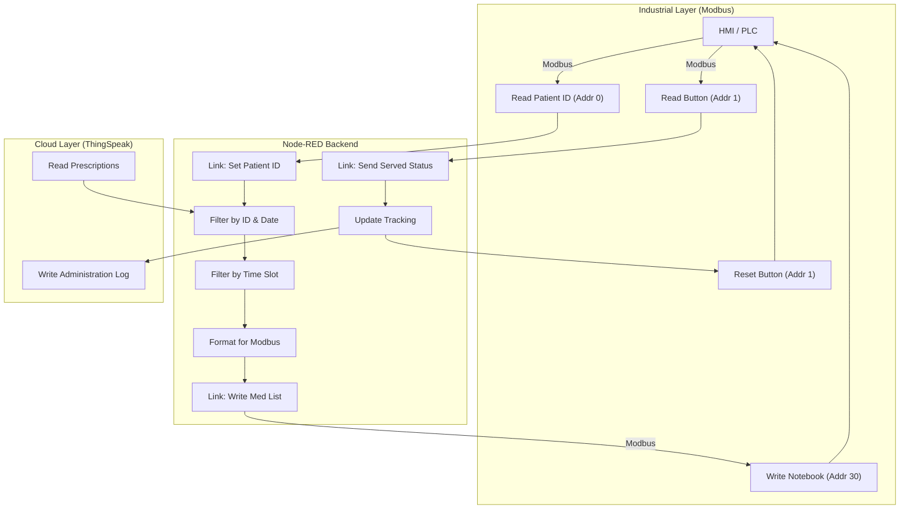

# eMAR Node-RED Implementation Report

This report documents the Node-RED implementation for the Electronic Medication Administration Record (eMAR) system. The system is designed to bridge a cloud-based prescription database (ThingSpeak) with a local industrial controller (Modbus PLC/HMI), enabling the display of medication schedules and tracking of administration.

The implementation is divided into two main flows: **Modbus** (Backend communication) and **Frontend** (Logic, API integration, and Dashboard).

---

## 1. System Overview

The system operates by:
1.  Reading a Patient ID from a local HMI/PLC via Modbus.
2.  Fetching prescription data for that patient from ThingSpeak.
3.  Filtering the data based on the current date and time.
4.  Sending the relevant medication list back to the HMI/PLC for display.
5.  Listening for a "Served" confirmation button press on the HMI.
6.  Logging the administration event back to ThingSpeak and clearing the display.

---

## 2. Modbus Communication Flow (`eMar - modbus.json`)

This flow handles the low-level communication with the industrial hardware using the Modbus TCP protocol.

### 2.1. Modbus Server Configuration
- **Type:** Modbus TCP Server
- **Hostname:** `192.168.250.2`
- **Port:** `10502`
- **Buffer Sizes:**
    - Coils: 1
    - Holding Registers: 120

### 2.2. Key Operations

#### **Reading Patient ID**
- **Operation:** Reads 10 Holding Registers (FC 3) starting at **Address 0**.
- **Processing:** The system interprets the registers as ASCII characters (2 characters per register). It decodes the byte stream to form a string (the Patient ID) and trims whitespace.
- **Output:** The decoded Patient ID is sent via a Link Node to the Frontend flow.

#### **Writing Medication List (Notebook)**
- **Operation:** Writes to 80 Holding Registers (FC 16) starting at **Address 30**.
- **Purpose:** Updates a "Notebook" component on the HMI to display the list of medications and dosages.
- **Input:** Receives formatted ASCII character codes from the Frontend flow.

#### **Button Interaction ("Served" Status)**
- **Read Served Button:** Reads Coil at **Address 1** (FC 3) to detect if the nurse has pressed the "Served" button.
- **Write Button Status:** Writes to Coil at **Address 1** (FC 5) to reset the button state (turn it off) after processing.

---

## 3. Frontend & Logic Flow (`eMAR- frontend.json`)

This flow contains the business logic, API integrations, and user interface for testing.

### 3.1. Data Acquisition (ThingSpeak)
- **Source:** ThingSpeak Channel `3124898` (Medicine_Prescription).
- **Method:** HTTP GET request to `https://api.thingspeak.com/channels/3124898/feeds.json`.
- **Logic:**
    1.  Receives the **Patient ID** from the Modbus flow.
    2.  Fetches prescription feeds.
    3.  Filters feeds based on:
        - **Patient ID:** Matches the ID read from the PLC.
        - **Date:** Checks if the current date falls within the prescription's `start_date` and `end_date`.
    4.  Stores the valid medication list in the flow context (`flow.currentPatientMeds`).

### 3.2. Scheduling & Display Logic
- **Triggers:**
    - **Automatic:** Scheduled Injections at **09:00, 13:00, 17:00, and 21:00**.
    - **Manual:** Dashboard buttons for testing.
- **Processing:**
    1.  Determines the current time (or test time).
    2.  Filters `flow.currentPatientMeds` to find medications scheduled for that specific time slot.
    3.  Formats the text for the HMI:
        - Pads lines to 20 characters.
        - Converts strings to 16-bit integer arrays (Modbus registers).
        - Limits output to 8 lines.
    4.  Sends the payload to the Modbus flow via Link Node ("Write MedicationList to Notebook").

### 3.3. Administration Tracking ("Served")
- **Trigger:** Receives the "Served" signal (Button Press) from the Modbus flow.
- **Actions:**
    1.  **Log to Cloud:** Sends an HTTP GET to ThingSpeak (`https://api.thingspeak.com/update`) to log the administration event.
        - **API Key:** `LOFTBPN6E2O124FE`
        - **Data:** Patient ID, Medicine, Dosage, Timestamp, Time Slot.
    2.  **Clear Display:** Sends a payload of spaces to the Modbus Notebook registers to clear the screen.
    3.  **Reset Button:** Sends a `0` payload to the Modbus Coil to uncheck the button on the HMI.

### 3.4. Dashboard (EdgeAI CM5)
A Node-RED Dashboard is provided for testing and visualization:
- **Inputs:** Manual entry for Test Date and Test Time.
- **Controls:** Buttons to manually trigger "Get full patient medication list" or "Get medication for medication round".

---

## 4. Data Flow Diagram

## 5. Integration Details

### Link Nodes
The system uses Node-RED "Link" nodes to decouple the protocol layer (Modbus) from the logic layer (Frontend).
- **`Set Patient ID (Modbus backend)`** → **`link in 3`**: Passes the decoded Patient ID string.
- **`Write MedicationList to Notebook`** → **`link in 4`**: Passes the formatted register array for display.
- **`Send served status`** → **`link in 7`**: Passes the button press event to trigger cloud logging and reset sequences.

### Error Handling
- **Retry Logic:** Both HTTP Request nodes (Reading and Writing to ThingSpeak) implement a retry mechanism (max 5 retries) with exponential backoff.
- **Empty Data:** The Modbus ID parser checks for empty registers to avoid processing invalid IDs.
